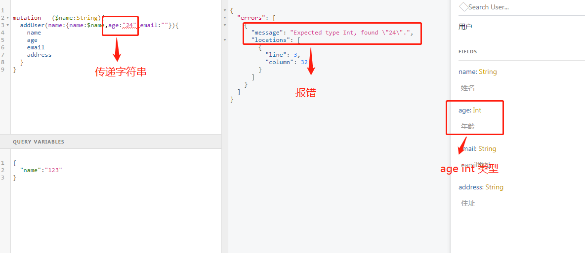
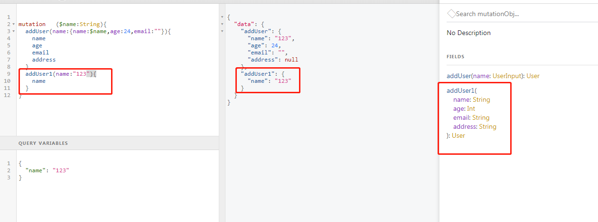

#1.graphql 不是数据库，他是数据api,用来代替rest api

#2.graphql 通过http 协议提供接口

#3.graphql 可以只提供一个接口，也可以是多个

    当提供一个接口时，后台所有的schema 对象形成一张大的图谱，这样在客户端请求时，可以请求嵌套资源，服务器端自动完成数据的获取和合并。

    提供多个接口时，嵌套资源需要请求多次

#4.graphql 优点：

+ 强类型检查
  
  graphql 在定义类型字段和参数时，都明确了字段和参数的类型，如果传递的类型不一样，或报错，

  

+ 允许客户端访问确切需要的数据字段，减少不必要的字段传输，从而一定程度上加快请求，提高性能
  
  
  
+ 允许嵌套获取数据，而不像rest Api 那样请求多个接口，graphql 只请求一次，减少http 请求.
  
  
  
**注意**
  
  不只是query，mutation 操作一样可以多个。

#5.不用再写单独的文档，grapiql 查询网页可以自带文档

        var User = new graphql.GraphQLObjectType({
            name: 'User',
            description:'用户',                    // 自定义类的说明
            fields: () => ({
                name: {
                    type: graphql.GraphQLString,   // 字段类型
                    description:'姓名'             //  字段说明
                },                
                age: {
                    type: graphql.GraphQLInt,
                    description:'年龄'
                },
                email: {
                    type: graphql.GraphQLString,
                    description:'eamil地址'
                },
                address: {
                    type: graphql.GraphQLString,
                    description:'住址'
                }
            })
        })   

#6.数据结构

graphql 使用图来描述数据对象，然后帮我们自动转成树机构。

例如，假设我们正在为图书馆构建一个编目系统。为了简单起见，我们的目录有很多书和作者，每本书至少有一个作者。作者也有合著者，作者与他们至少写过一本书

**注意**

graphql允许我们从应用程序数据图中提取树。

