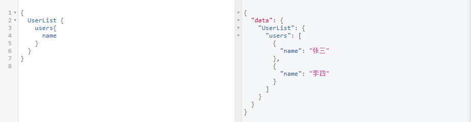
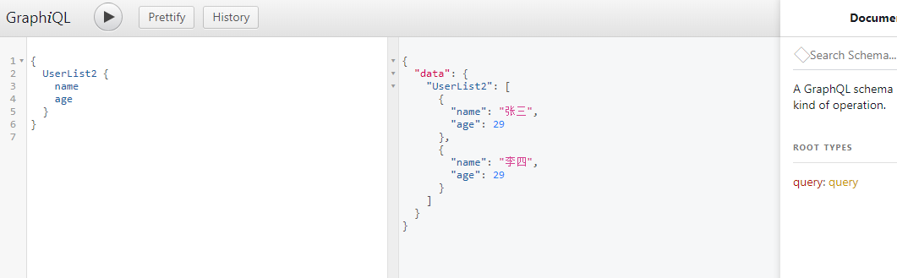

> 单独定义类型，使用集合类

         var UserList = new graphql.GraphQLObjectType({
            name: 'UserList',
            fields: () => ({
                users: {
                    type: new graphql.GraphQLList(User),
                }
            })
        })

        // 解析时
         UserList: {
            type: UserList,
            resolve() {
                return {
                    users: [{
                            name: '张三',
                            age: 29,
                            email: 'lisi@163.com',
                            address: '北京海淀区'
                        },
                        {
                            name: '李四',
                            age: 29,
                            email: 'lisi@163.com',
                            address: '北京海淀区'
                        }
                    ]
                }
            }
        }

这种解析时，会多出users 字段，查询的时候也要有users

> 直接解析时定义集合类

         // 或者

        UserList: {
            type: new graphql.GraphQLList(User),
            resolve() {                 
                return  [{
                            name: '张三',
                            age: 29,
                            email: 'lisi@163.com',
                            address: '北京海淀区'
                        },
                        {
                            name: '李四',
                            age: 29,
                            email: 'lisi@163.com',
                            address: '北京海淀区'
                        }
                    ]                
            }
        }
