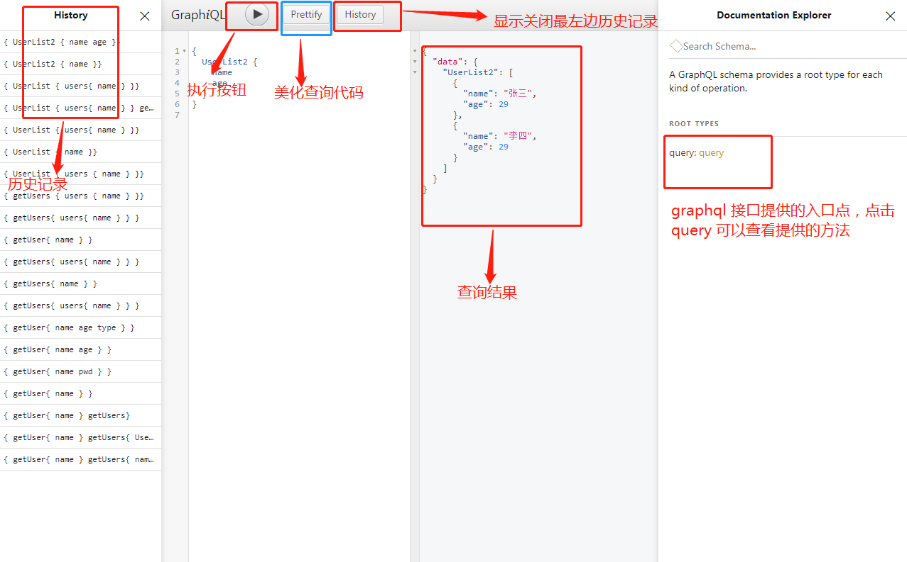
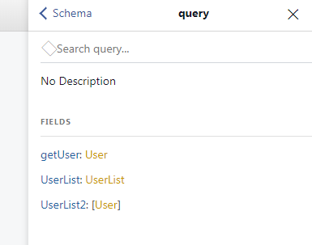
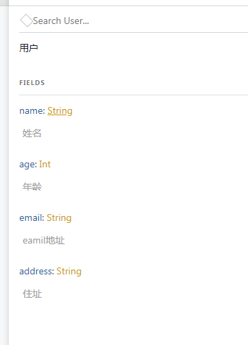
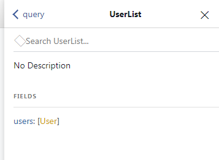
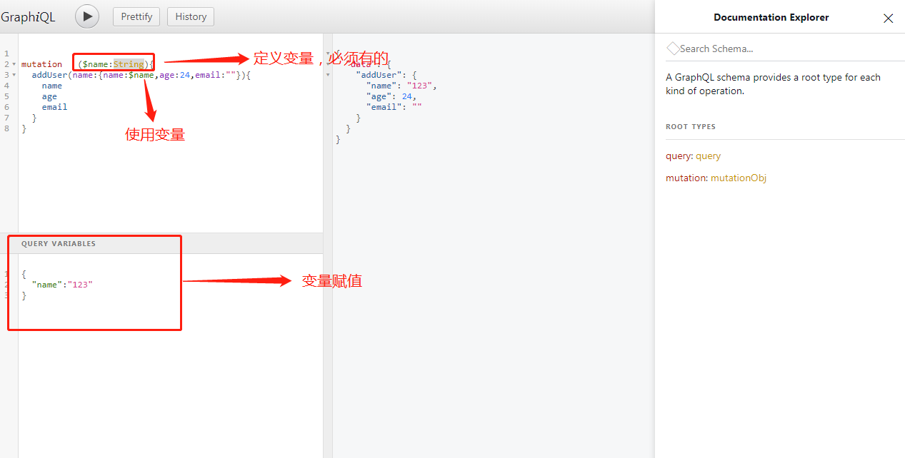

#1.graphql.js 是facebook 开源的拥有JavaScript的graphql 库。

#2.graphiql 使用

graphiql 是graphql 自带的浏览器端测试工具

        app.use('/graphql', expressGraphql({
            schema: schemaObj,
            graphiql: true        -------> 开启graphiql
        }))

在浏览器中输入graphql 接口地址：localhost:3000/graphql

#3.点击query可以查看query 提供的操作

提供了三个字段：
+ getUser: User 对象类型
  
        对应js :

        getUser:{}  
我们点开User ,继续查看User 对象中可以拥有的字段

里面的字段就是我们可以查找的所有字段

所以可以转化为js

        getUser{
            name
            age
            email
            address
        }

**注意**

里面有的字段才可以查询，如果查询不存在的字段会报错。

+ UserList: UserList 类型
  
  我们点击UserList 类型查看
  
  里面有一层users: User 集合
  在点击User 到User 说明：
  

  所以可以转化js

        UserList{
            users{
                name
                age
                email
                address
            }
        }

+ UserList2: User 集合

#4.我们可以根据query 里面的层次推断出数据层次机构图

#5.使用变量参数

