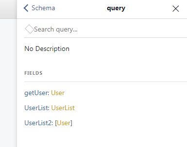

#1.查询: query里面对应的操作

**注意**

graphql 接口中没有提供的字段是不能查询的，不然会报错

#2.查找单个对象

        {
            getUser{
                name
            }
        }

        返回
        {
            "data": {
                "getUser": {
                    "name": "张三"
                }
            }
        }

        多个字段
        {
            getUser{
                name
                age
            }
        }

        {
            "data": {
                "getUser": {
                    "name": "张三",
                    "age": 29
                }
            }
        }

#3.嵌套和数组的查询

        {
            UserList{
                users{
                    name
                    age
                    address
                }
            }
        }
        返回：
        {
            "data": {
                "UserList": {
                    "users": [
                        {
                        "name": "张三",
                        "age": 29,
                        "address": "北京海淀区"
                        },
                        {
                        "name": "李四",
                        "age": 29,
                        "address": "北京海淀区"
                        }
                    ]
                }
            }
        }

        // users 是个集合，但是查找name一样的操作
        users{
            name
            age
            address
        }

#4. 一次性操作多个（对应rest api 中的并发接口)

同时查询getUser,UserList，graphql 服务器自动解析对应的数据，并一并返回给前端。

这类操作解决rest api 中并发多个请求，减少http 请求连接。

**注意-注意-注意**

我们**只能**查找graphql 服务器提供的字段，如果字段不存在则会报错。

#5. 别名 使用别名替换数据的名字

比如我们定义了自己的model， model 中字段和数据返回不一致，我们可以使用别名替换数据返回中名字，和我们自定义的model 对应

#6. fragment 创建一个片段

创建一个片段，用来处理重复的数据字段

        fragment fragmentName on Type

        fragment user on User {
            name
            age
            address
        }
        user: fragmentName 片段名称
        Type: 对应的graphql 服务类型

        {
            UserList {
                users {
                ...user
                }
            }
            UserList2 {
                ...user
            }
        }

**注意**

+ 字段必须在设置的类型中，不然会报错
+ Type 类型必须写准确不然会找不到字段会报错

#7. 所有字段都可以有参数，使用这些参数的方式与使用函数参数的方式相同

您可以将graphql字段视为函数，而不是属性

#8. 参数变量

正如变量允许您通过更改参数来创建动态查询一样

#9. 指令

指令允许您构造动态查询，以修改其结果的结构和形状

可以将指令附加到字段或片段。所有指令都以@符号开头

graphql服务器可以公开任意数量的指令，但是graphql规范定义了两个强制指令，

+ @include（if:boolean） if为真时包含字段
+ @skip（if:boolean）if为真时跳过字段。

#10. 参数默认值

  query ($withPins: Boolean = true) {

  

