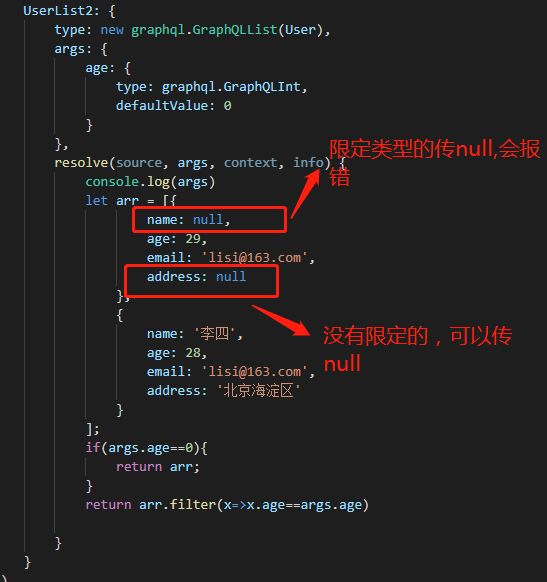

#1. 对象定义

我们可以把graphql 中的对象，分成两部分

+ model 类似于我们mvc 中的model 
+ 给model 赋值的对象（可以看成函数，包括参数和resolve解析）

#2.定义对象

+ 首先导入graphql 库
  
        let graphql=require('graphql')
        这种每次定义都要带上  graphql.GraphQLString

        let {
            GraphQLString,
            GraphQLObjectType
            }=require('graphql')
        这种就要把用到的都要引进来
+ 定义model
  
            var User = new graphql.GraphQLObjectType({
                name: 'User',            // name 必须的，而且唯一，不能重复
                description: '用户',     // 类型描述
                fields: () => ({        // 字段，可以是对象（{}） 亦可以是返回对象的函数
                    name: {
                        type: graphql.GraphQLString,
                        description: '姓名'
                    },
                    age: {
                        type: graphql.GraphQLInt,
                        description: '年龄'
                    },
                    email: {
                        type: graphql.GraphQLString,
                        description: 'eamil地址'
                    },
                    address: {
                        type: graphql.GraphQLString,
                        description: '住址'
                    }
                })
            })

#3.字段和字段配置

>字段定义包含字段名和字段配置

比如:

     name:{}
**注意** 

字段配置说明必须是对象（{}）格式，不然会报错

        pwd:'密码'

        User.pwd field config must be an object

>字段类型：type

字段可以是标量类型（即graphql 内置类型),也可以是数组类型（GraphQLList），亦可以是自定义对象

        var UserInfo=new graphql.GraphQLObjectType({
            name:'UserInfo',
            fields:()=>({
                user:{type:User},      // --------->自定义类型对象
                pwd:{
                    type: graphql.GraphQLString  // 字符串
                },
                list:{
                    type:new GraphQLList(User)   // 自定义对象集合
                }
            })
        })

>字段描述：description

字段描述用来给前端人员看的文档说明。如图：

我们可以知道User 对象中包含的字段，字段类型，和字段代表的含义。一个完整的文档。

**注意**

我们对象里面定义什么字段，前端才能使用什么字段，如果前端调用了我们未定义的字段，会报错。

Cannot query field \"pwd\" on type \"User\".
graphql 会解析不到我们的字段。

>非空字段

非空字段指的是字段不能返回null，返回空是可以的

        var User = new graphql.GraphQLObjectType({
            name: 'User',
            description: '用户',
            fields: () => ({
                name: {
                    type: new graphql.GraphQLNonNull(graphql.GraphQLString),   // 非空字段
                    description: '姓名'
                },
                age: {
                    type: graphql.GraphQLInt,
                    description: '年龄'
                },
                email: {
                    type: graphql.GraphQLString,
                    description: 'eamil地址'
                },
                address: {
                    type: graphql.GraphQLString,
                    description: '住址'
                },
            })
        })

+ 如果传null
  

  
+ 如果传空字符串
  

  

**注意**

通过以上实例，可以确定graplql 中的非空指的是null ,不能为null，可以为空字符串。
  
