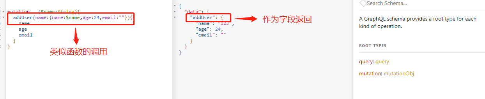
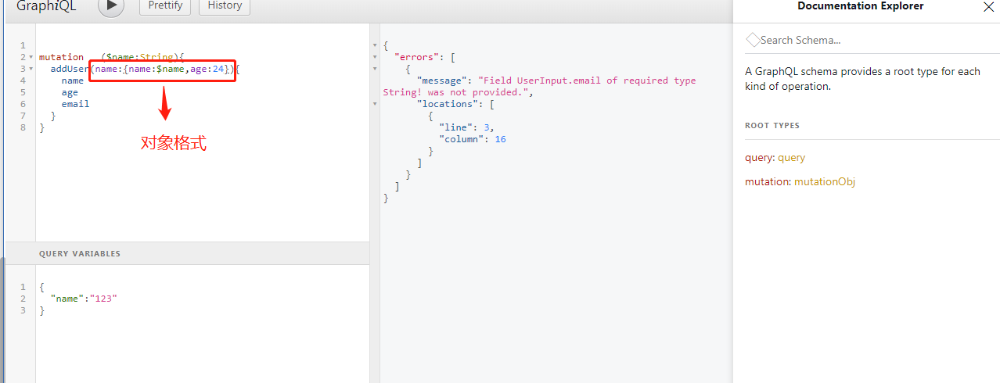
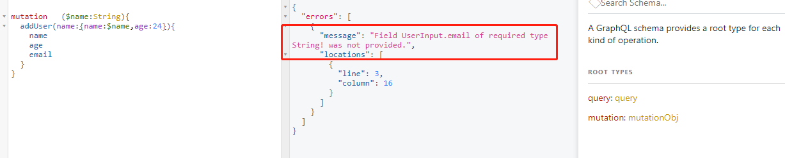
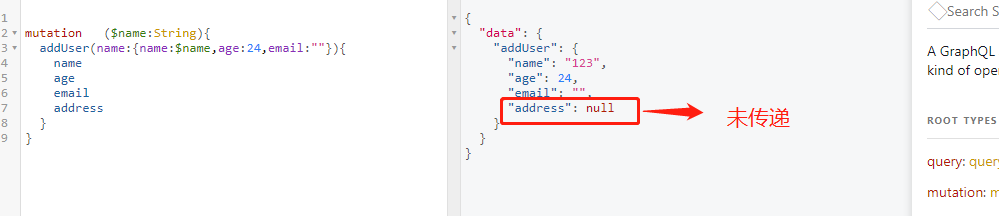
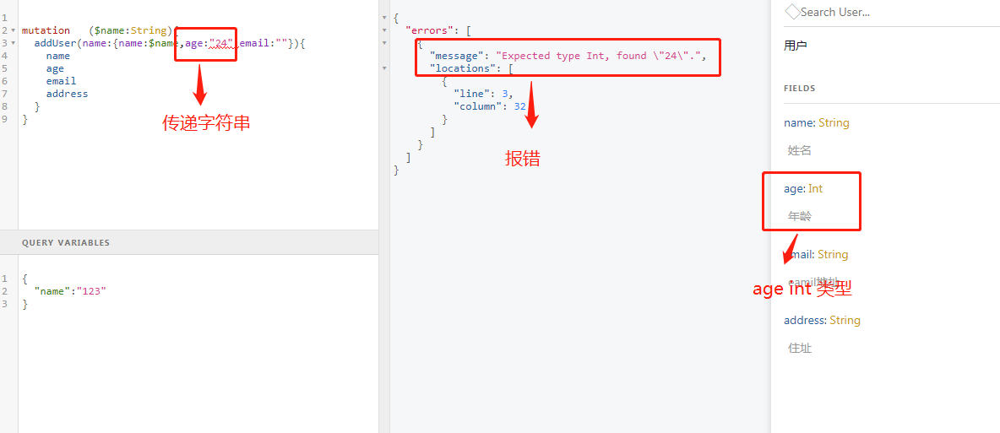
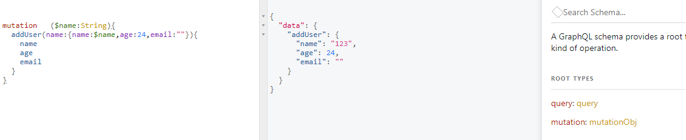
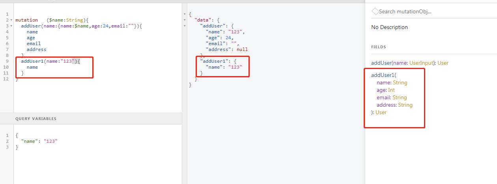
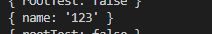
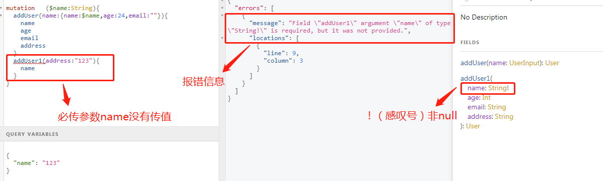

#1. mutation 是graphql接口 schema中公开的操作数据的入口点。

#2.mutation 与query 的不同

+ query 是查询数据的入口点，类似rest api 中的get 请求，mutation 是数据操作更改的入口点，类似rest api 中post，put, delete
+ query 是定义schema 时，必须提供的。mutation 非必须

#3. mutation 解析方法

在graphql 中字段的定义和js 中理解的不一样，因为所有的字段都可以有参数，使用起来有点类似函数的方式。
在使用过程中就像我们rest api 中提供的处理参数的方法。但是在graphql 中它又作为对象字段名返回。

#4. mutation 定义

因为在graphql 中只有resolve 能处理请求，所以要用GraphQLObjectType 定义

GraphQLInputObjectType 输入类型，常用于参数是一个对象时，要单独定义一个类型.

> GraphQLInputObjectType 定义对象
 
 + 字段为非空（null) ，那么参数要必须传递

  
 + 字段没有限制，如果不传递那么参数为null
  
  
 + 字段类型传参要一致，不然会报类型错误
 + 
  

> 定义

        var mutationObj=new graphql.GraphQLObjectType({
            name:'mutationObj',      // name 必须的
            fields:()=>({
                addUser:{
                    type:User,      // 返回类型
                    args:{
                        name:{type:UserInput}   // name参数为对象格式
                    },
                    resolve(root,args,context,info){
                        console.log(root)
                        return args.name      // 使用args 获取参数
                    }
                }
            })
        })

    // 使用
    var schemaObj = new graphql.GraphQLSchema({
        query: queryObject,
        mutation:mutationObj
    })

>参数为非对象时，比如过个参数

        var mutationObj=new graphql.GraphQLObjectType({
            name:'mutationObj',
            fields:()=>({
                addUser:{
                    type:User,
                    args:{
                        name:{type:UserInput}
                    },
                    resolve(root,args,context){
                    
                        console.log(root)
                        return args.name
                    }
                },
                addUser1:{
                    type:User,
                    args:{
                        name:{type:graphql.GraphQLString},   //参数定义
                        age:{type:graphql.GraphQLInt},
                        email:{type:graphql.GraphQLString},
                        address:{type:graphql.GraphQLString}
                    },
                    resolve(root,args,context,info){
                        console.log(args)
                        return {
                            ...args
                        }
                    }
                }
            })
        })

**注意**

+ 没有使用非null定义的参数，都是可选的。可以不传值
  
  
+ 没有传值的参数，不会解析到args 中，args 中只有传递的参数
  
+ 设置非空参数，就必须设置
  